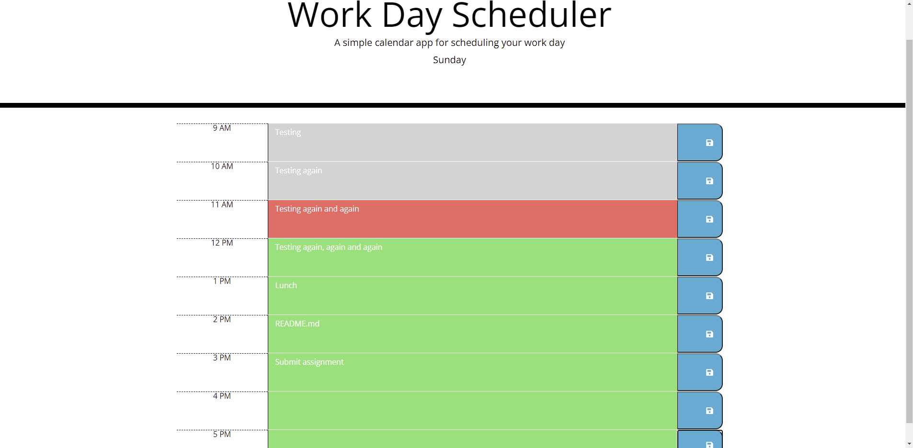

# **Work Day Scheduler**
_Click image to use Work Day Scheduler_

## **Table of Contents**

* Description
* How to use

### **Description**

This is my Work Day Scheduler application. The intent of this is to display my skills using logic, moment.js, and jQuery. The benefit of this application is to help keep yourself organized for a 9 to 5 workday. This application utilizes browser based local storage. This means that whatever device you use is the only device that will have your stored schedule. 

### **How to Use**

* Once you have opened the application there should be the day of the week displayed at the bottom of the header.

* Now, you can click which ever text area for the correct block of time. Type whatever you would like into it and DON'T FORGET TO CLICK THE SAVE ICON!

* If you don't want a specific item to display in your work schedule anymore then you will have to delete that hours block. DON'T FORGET TO CLICK THE SAVE ICON!